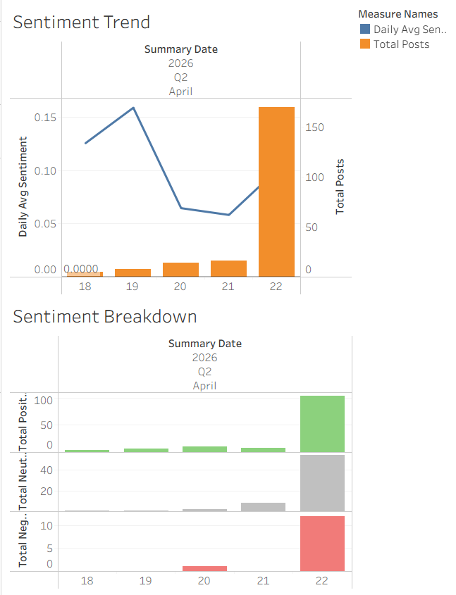

What is the internet saying about a Kalshi prediction market, and does that sentiment move before the price does?

The pipeline continuously monitors Reddit for posts discussing Federal Reserve rate cut expectations, scores public mood using NLP, simultaneously tracks live Kalshi contract prices, stores everything in a cloud data warehouse, and visualizes the sentiment-vs-price relationship on a live dashboard.

The primary tracked market is "Number of rate cuts in 2026?" (KXRATECUTCOUNT-26DEC31), which runs through December 31, 2026 — providing months of live data to analyze. The yes_bid prices across the 0-cut, 1-cut, 2-cut, and 3-cut contracts are combined into a single implied expected cuts metric that moves continuously as market participants update their Fed outlook.

Setup & Installation 

Prerequisites:
- Python 3.10+
- Docker Desktop
- Java 17 (Adoptium Temurin recommended)
- Git

Environment Setup
# Clone the repo
git clone https://github.com/yourusername/kalshi-sentiment-pipeline
cd kalshi-sentiment-pipeline

# Create and activate virtual environment
python -m venv .venv
.venv\Scripts\activate          # Windows
source .venv/bin/activate       # Mac/Linux

# Install dependencies
pip install -r requirements.txt

# Download NLTK language data
python -c "import nltk; nltk.download('punkt'); nltk.download('averaged_perceptron_tagger')"

Running the Pipeline 
Run the reddit producer, kalshi producer, and sentiment stream each simultaneously in a different terminal. Batch confirmations print in sentiment stream output as data flows through. Then run the dbt build, export/refresh mart tables as CSVs to connect to Tableau Public, and the dashboards are ready to be assembled. 

